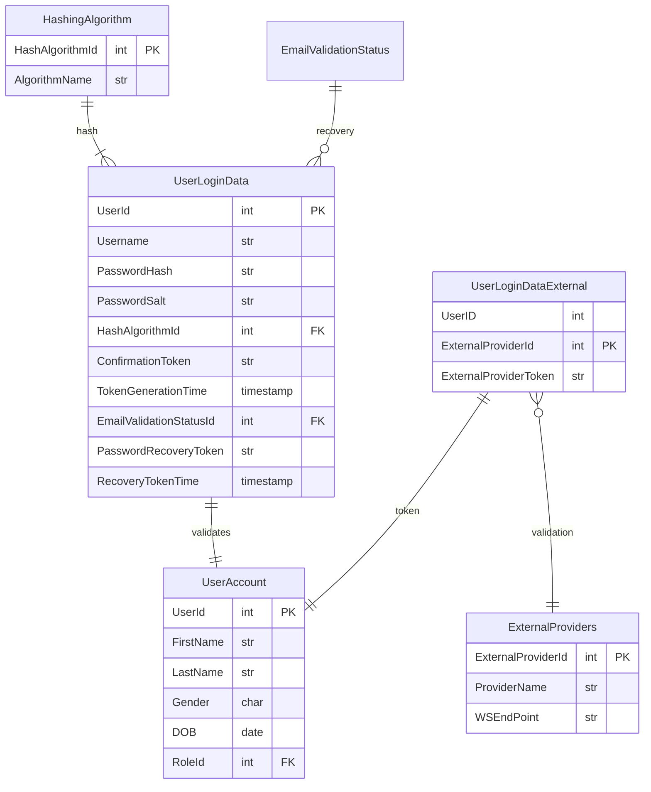

# Readme

## User Authentication w/ SQLite + Passport

<https://vertabelo.com/blog/user-authentication-module/>

As written in their article, take note that these are the capabilities expected of an authentication module.

- Register new users
- Send confirmation emails.
- Provide secure options for recovering a forgotten password.
- Protect auth data from unauthorized access.
- Support auth via third-parties.
- Define roles and permission sets per role.

This is the flowchart they provided to shed light on the validatin procedure.


*Use SHA-3 to hash but incorperate the ability to use different hashing algorithms incase there is a vuln detected in the future.*

### Salting Passwords

Salt is a random string generated when the password is set. It has to be stored in the auth data table along with the password hash.

The benefit of doing this is that it introduces a random factor, so even if two people choose the same password, the salt intervenes in the hashing algo and creates a unique hash.

### Primary Keys

- The login name is unique but we would rather allow the possibility to change the username.
  - If we use the login to salt, then changing the username will prove annoying.
- So the primary key should be an abstract number generated.


### Email Confirmation

- Design an authentication module with a mechanism to verify the vlidity of the email addrses.

### Final Schema




## Prisma w/ SQLite

1. `prisma generate`
2. `prisma db push` to push the schema to your database
3. Instantiate the Prisma Client in code examples below.

Add this to code:

```ts
import { PrismaClient } from '@prisma/client'
const prisma = new PrismaClient()
```

## Fastify, Vue, Vite

### Folder/File Structure?

```folder
/src
    /server
        server.ts
        /controllers
        /routes
    /client
```

### Fastify-Websockets

```md
@fastify/websocket accept these options for ws :

host - The hostname where to bind the server.
port - The port where to bind the server.
backlog - The maximum length of the queue of pending connections.
server - A pre-created Node.js HTTP/S server.
verifyClient - A function which can be used to validate incoming connections.
handleProtocols - A function which can be used to handle the WebSocket subprotocols.
clientTracking - Specifies whether or not to track clients.
perMessageDeflate - Enable/disable permessage-deflate.
maxPayload - The maximum allowed message size in bytes.
```

### Incorperated Fastify instead of Express

Fastify seems to be a lightweight framework that is better thatn express because of the low overhead.

## Recommended IDE Setup

- [VS Code](https://code.visualstudio.com/) + [Volar](https://marketplace.visualstudio.com/items?itemName=Vue.volar)

## Type Support For `.vue` Imports in TS

Since TypeScript cannot handle type information for `.vue` imports, they are shimmed to be a generic Vue component type by default. In most cases this is fine if you don't really care about component prop types outside of templates. However, if you wish to get actual prop types in `.vue` imports (for example to get props validation when using manual `h(...)` calls), you can enable Volar's Take Over mode by following these steps:

1. Run `Extensions: Show Built-in Extensions` from VS Code's command palette, look for `TypeScript and JavaScript Language Features`, then right click and select `Disable (Workspace)`. By default, Take Over mode will enable itself if the default TypeScript extension is disabled.
2. Reload the VS Code window by running `Developer: Reload Window` from the command palette.

You can learn more about Take Over mode [here](https://github.com/johnsoncodehk/volar/discussions/471).
